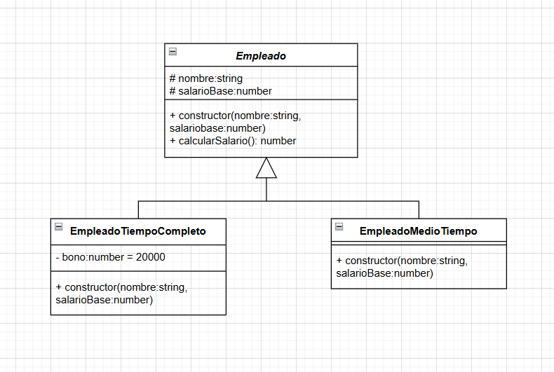
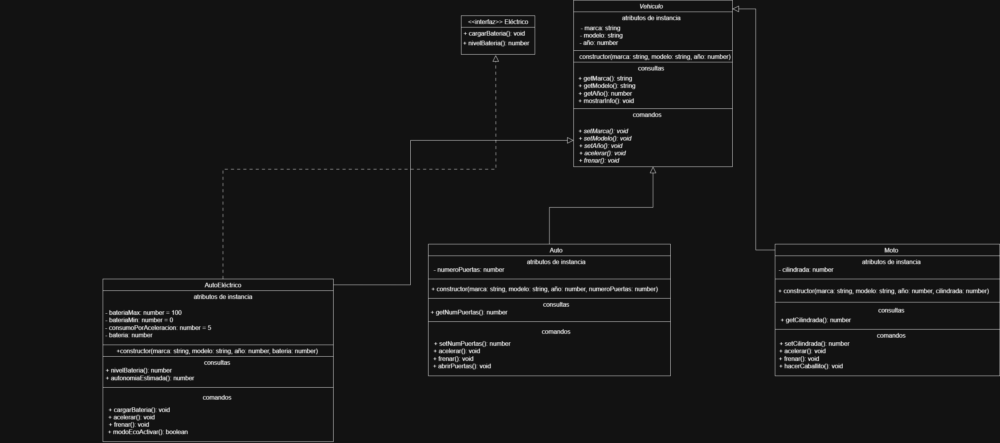

## Ejecutar

```bash
# Instalar dependencias
npm install

# Ejecutar un ejercicio específico
npm run eje1
npm run eje2
npm run eje3
npm run eje4
npm run eje5
```

## Diagramas UML

### Ejercicio 3 - Herencia y Polimorfismo



### Ejercicio 5 - Diseño de UML propio



## Conceptos implementados

- **Interfaces**: Contratos que definen métodos obligatorios
- **Herencia**: Clases que extienden funcionalidad de otras clases
- **Polimorfismo**: Objetos de diferentes tipos tratados como el mismo tipo
- **Clases Abstractas**: Clases base que no pueden instanciarse
- **Encapsulación**: Atributos privados con getters/setters

## Integrantes del grupo:
+ Mateo Avila Baez
+ Ramiro Gabeiras
+ Gino Robla Belleggia
+ Lautaro Carrio