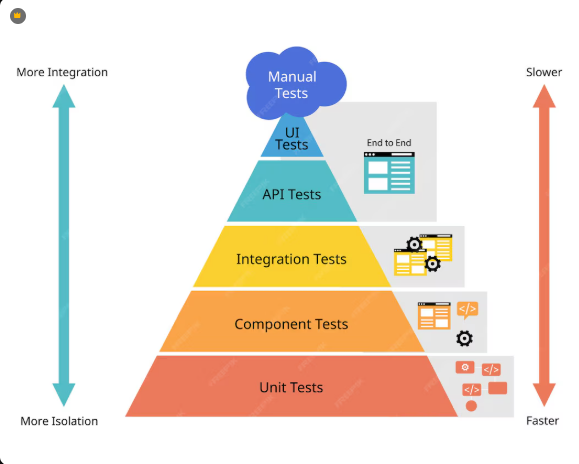

# PROGRAMACION IV - TRABAJO PRACTICO 2 - TEORIA

## 1- Ciclo Rojo -> Verde -> Refactor

El ciclo **Rojo -> Verde -> Refactor** pertenece a el enfoque TDD y representan tres pasos. El (Rojo) en el cual se escribe un test que falla, es decir define un comportamiento porque la funcionaliidad aun no existe. El (Verde) en el cual se implementa el codigo minimo necesario para que la prueba pase y el (Refactor) en el cual su funcion es limpar el codigo manteniendo los test en verde, se mejora la estructura del codigo sin alterar su comportamiento.

Este ciclo asegura que todas las funcionalidades del programa sean testeadas desde el inicio y genera un diseno limpio y mantenible. Es importante que el tamano de estos pasos sea lo menor posible ya que obtener retroalimentacion rapida, encontrar errores facilmente y mantener un avance controlado en el desarrollo.

## 2- Diferencie tests unitarios, de integración y E2E en APIs

Los **Test unitarios** prueban funcionalidades aisladas como pueden ser funciones o metodos, sin dependencias externas. Este tipo de testeos permite verificar la logica de las partes mas chicas del programa, su velocidad de ejecucion es la mas rapida. En el caso de los **Test de integracion** comprueban como funcionan varias partes del sistema. Entre estos la comunicacion entre modulos, la base de datos y la capa de red. El objetivo principal de este tipo de test es verificar el funcionamiente de interfaz y comunicacion, los cuales no se testean al probar modulos por separado. Por ultimo los test **E2E** o **End to End** en APIs, simulan el flujo completo, desde el cliente hasta la base de datos real y el servidor en ejecucion. Se comprueba todos los componente del porgrama: frontend, backend, base de datos, APIs externas. Este tipo de testeo son los mas lentos.

En conclucion las diferencias mas notables entre estos tipos de testeo son la velocidad de ejecucion y el alcanze de las pruebas, esta relacion se puede ver de manera grafica en la piramide de pruebas

## 3- ¿Qué es un doble de prueba? Defina mock, stub y spy y cuándo conviene cada cada uno.

Los **Dobles de prueba** son objetos que se usan en lugar de las dependencias reales durante las pruebas unitarias o de integracion, esto permite aislar las pruebas del entorno de desarrollo y simular los escenarios necesarios en pruebas controladas.

Se le conoce como **Mock**  a un tipo de Dobles de prueba que testean funciones o clases aisladas, sin dependencias externas y se utilizan para verificar el comportamiento de una dependencia durante una prueba. Tienen la particularidad de que son rapidos y faciles de ejecutar. Este tipo de prueba conviene usarlo cuando se quiere verificar como interactua el codigo con una dependencia, no solo el resultado final.

**Stub** es otro tipo de Doble de prueba en el cual los datos que le proporcionamos estan predefinidos, se usa para que devuelva una respuesta especifica y controlar los datos de entrada o salida de una dependencia, con la logia aislada del componente a probar. Este tipo de prueba conviene usarla cuando el codigo que se prueba necesita recibir datos especificos para su funcionalidad.

Los Dobles de prueba **Spy** a diferencia de los otros utiliza la funcion original y registra el comportamiento de una dependencia durante una prueba, para poder verificar que funcione correctamente. Este tipo de prueba conviene usarla cuando necesitamos probar la logica real de una funcion y al mismo tiempo confirmar ciertos efectos resultantes de la ejecucion.

## 4- ¿Por qué es útil separar app de server? Muestre (en 8–10 líneas) un ejemplo mínimo con makeApp() y un test de integración con Supertest.

//Completo mañana @Rama

## 5- Zod: diferencia entre parse y safeParse. ¿Dónde usaría cada uno en una ruta Express y por qué?

Tanto **Parse()** como **safeParse()** son usados para validar datos ocn un esquema Zod, pero cambian en como manejan los errores de validacion.

**Parse()** lanza una excepcion. Si la validacion falla, detiene la ejecucion del programa tirando un error. Lo usaria dentro de un middleware de validacion antes de la ruta principal, ya que si lanza un error, el middleware de errores de express lo captura y podes responder con una respuesta HTTP 400 estandarizada.

**safeParse()** retorna un objeto, no una excepcion, se usa para verificar si la parte del codigo es un positivo o negativo. Este como se usaria dentro del controlador de la ruta ya que permite controlar el fluJo inmediatamente, por ejemplo si falla, el controlador puede responder sin depender de el middleware de errores.

## 6- Dé dos ejemplos de reglas de dominio que deben probarse con tests unitarios (no sólo validación de entrada).

1. Regla de dominio: No se puede confirmar un pedido si no hay stock del producto seleccionado.
   
   Test unitario: comprobar que si el stock es menor a la cantidad seleccionada por el cliente, el pedido no se pueda confirmar.

2. Regla de domino: Al confirmar un pedido, el stock del producto se descuenta automaticamente.
   
   Test unitario: Verificar que al confirmar un pedido de 10 unidades, el stock se reduce en 10 unidades.

## 7- ¿Qué malos olores suele haber en suites de tests? Dé 3 ejemplos (naming, duplicación, asserts débiles, mocks frágiles, etc.).

//Completo mañana @Rama

## 8- ¿Cómo trazará criterios de aceptación ↔ tests? Incluya un mini ejemplo de tabla con 2 filas.

//Completo mañana @Rama

## 9- ¿Por qué no perseguir 100% de cobertura a toda costa? Mencione

No es necesario perseguir el 100% de covertura ya que generar pruebas para cada linea de codigo gasta mucho tiempo valioso. Muchas de las pruebas que se escribirian cubirian codigo que nunca falla o es innecesario, sacando tiempo a la generacion de casos de prueba en areas criticas del programa. Lo recomendable es apuntar a un porcentaje mas bajo pero con pruebas mas solidas y enfocadas en la logica del programa.