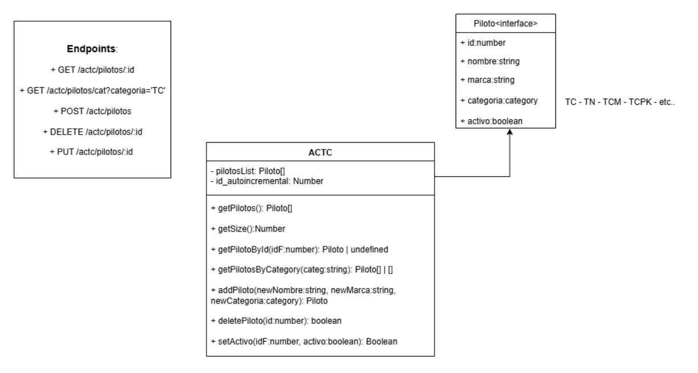

# Practico 2 - Programacion IV

### Comandos para construir el proyecto

1. Clonar el repositorio
```bash
git clone https://github.com/Mada98/Programacion-IV.git
```

2. Entrar a la carpeta del Practico 2
```bash
cd Practico 2
```

3. Instalar las dependecias:
```bash
npm i
```

### Comandos para correr la API
1. Construir
```bash
npm run build
```

2. Levantar el server
```bash
npm run dev
```

### Comandos para correr los test y coverage

+ Tests
```bash
npm run test
```

+ Coverage
```bash
npm run coverage
```

## Tema del Mini-Proyecto

Una API para gestionar pilotos de las distintas categorias de la ACTC

Tenologias utilizadas:
- Typescript
- Vitest
- Supertest
- Zod

## Diagrama de clase



## Evidencia de TDD:
1. Test basico - Rojo
2. Implementacion Minima - Verde
3. Refactor (A veces)
4. Test de integracion - Rojo
5. Implementacion minima - Verde
6. Refactor (A veces)

Evidencia: Historial de Commits

## User Stories

+ US1: "como cliente quiero buscar un piloto segun su id para ver su informacion"
+ US2: "como cliente quiero ver los pilotos que pertenecen a una categoria en especifico"
+ US3: "como cliente quiero agregar un piloto a una categoria"
+ US4: "como cliente quiero eliminar un piloto de una categoria"
+ US5: "como cliente quiero modificar el estado del piloto (activo o no)"

## Curls para testear al API

### GET

+ Obtener un piloto por el ID

```bash
curl http://localhost:3000/actc/pilotos/:id
```

+ Obtener una lista de pilotos segun una categoria
```bash
curl http://localhost:3000/actc/pilotos/cat?categoria=""
```

### DELETE

+ Eliminar un piloto por ID
```bash
curl -X DELETE http://localhost:3000/actc/pilotos/:id
```

### PUT

+ Obtener todos los Prestamos realizados

```bash
curl -X PUT http://localhost:3000/actc/pilotos/:id \
  -H "Content-Type: application/json" \
  -d '{
  "activo":true
}'
```

### POST

+ Agregar un piloto
```bash
# Los tipos de categorias son: TC, TCP, TCPK, TCPPK, TC2000, TP y TN
curl -X POST http://localhost:3000/actc/pilotos \
  -H "Content-Type: application/json" \
  -d '{
  "nombre":"Werner",
  "marca":"Toyota",
  "categoria":"TCPK"
}'
```

## Plantillas de casos

### US1 - GET /actc/pilotos/:id

| ID | Caso / Descripción | Precondición (estado/mocks) | Input (query/body/params) | Acción (HTTP) | Resultado esperado | Test (archivo · nombre) |
|---|----------------|--------------|------------------|--------------------|--------------------|---------|
| CA1 | Buscar piloto que coincida con el ID | Servicio con: [` {"id":1, "nombre": "Santero", ...},{...} `] | :id = 1 (req.params.id)| GET /actc/pilotos/1 | 200 . Body: `{id:1, nombre:Santero, ...}` | tests/integration/ACTCservice.getPilotoById.integration.test.ts |
| ERR1 | Buscar piloto que no coincida con el ID| Servicio con: [` {"id":6, "nombre": "German", ...},{...} `] | :id = 1 (req.params.id) | GET /actc/pilotos/1 | 404 . Body: `{"error": "Error: no existe un piloto con ese id"}` | tests/integration/ACTCservice.getPilotoById.integration.test.ts |

---

### US2 - GET /actc/pilotos/cat?categoria=

| ID | Caso / Descripción | Precondición (estado/mocks) | Input (query/body/params) | Acción (HTTP) | Resultado esperado | Test (archivo · nombre) |
|---|----------------|--------------|------------------|--------------------|--------------------|---------|
| CA1 | Lista de pilotos que coincida con la categoria| Servicio con: [` {"id":1,..., "categoria": "TCPK"}, {"id":2,..., "categoria": TCPK} `] | categoria=TCPK | GET /actc/pilotos/cat?categoria=TCPK | 200 . Body: `{"id":1,..., "categoria": "TCPK"}, {"id":2,..., "categoria": TCPK}` | tests/integration/ACTCservice.getPilotoByCategory.integration.test.ts |
| CA2 | Sin coincidencias -> Lista vacia | Servicio con: [`{"id":1,..., "categoria": "TCPK"}, {"id":2,..., "categoria": "TCPK"}`] | categoria=TC2000 | GET /actc/pilotos/cat?categoria=TC2000 | 200 . [] | tests/integration/ACTCservice.getPilotoByCategory.integration.test.ts |
| ERR1 | **categoria** vacio -> 400| - | categoria= | GET /actc/pilotos/cat?categoria= | 400 . Body: ` {"error": "validationError","detail": "Faltan datos"}` | tests/integration/ACTCservice.getPilotoByCategory.integration.test.ts |

---

### US3 - POST /actc/pilotos

| ID | Caso / Descripción | Precondición (estado/mocks) | Input (query/body/params) | Acción (HTTP) | Resultado esperado | Test (archivo · nombre) |
|---|----------------|--------------|------------------|--------------------|--------------------|---------|
| CA1 | Agregar un piloto | - | Body: `{"nombre":"Ciantini", "marca":"Chevrolet", "categoria":"TC"}` | POST /actc/pilotos | 201 . Body: `{"id":1, "nombre":"Ciantini", "marca":"Chevrolet", "categoria":"TC", "activo":true}` | tests/integration/ACTCservice.addPiloto.integration.test.ts |
| ERR1 | Agregar un piloto con datos faltantes (sin marca)| - | Body: `{"nombre":"Ciantini", "categoria":"TC"}` | POST /actc/pilotos | 400 . Body: `{"error": "validationError", "detail": "Faltan datos"}` | tests/integration/ACTCservice.addPiloto.integration.test.ts |
| ERR2 | agregar un piloto a una ctegoria inexistente| - | Body: `{"nombre":"Ciantini", "marca":"Chevrolet", "categoria":"TCS5689"}` | POST /actc/pilotos | 400 . Body: ` {"error": "Error al crear un piloto nuevo"}` | tests/integration/ACTCservice.addPiloto.integration.test.ts |

---

### US4 - DELETE /actc/pilotos/:id

| ID | Caso / Descripción | Precondición (estado/mocks) | Input (query/body/params) | Acción (HTTP) | Resultado esperado | Test (archivo · nombre) |
|---|----------------|--------------|------------------|--------------------|--------------------|---------|
| CA1 | Eliminar piloto que coincida con el ID | Servicio con: [` {"id":1, "nombre": "Santero", ...},{...} `] | :id = 1 (req.params.id)| DELETE /actc/pilotos/1 | 204 | tests/integration/ACTCservice.deletepiloto.integration.test.ts |
| ERR1 | Eliminar piloto que no coincida con el ID| Servicio con: [` {"id":6, "nombre": "German", ...},{...} `] | :id = 1 (req.params.id) | DELETE /actc/pilotos/1 | 404 . Body: `{"error": "No se encontro un piloto con ese ID"}` | tests/integration/ACTCservice.deletepiloto.integration.test.ts |

---

### US5 - PUT /actc/pilotos/:id

| ID | Caso / Descripción | Precondición (estado/mocks) | Input (query/body/params) | Acción (HTTP) | Resultado esperado | Test (archivo · nombre) |
|---|----------------|--------------|------------------|--------------------|--------------------|---------|
| CA1 | Modificar estado del piloto a false | Servicio con: [` {"id":1, ""nombre": "Santero", ..., "activo": true}, {...} `] | :id = 1 (req.params.id) - Body: `{"activo: false"}`| PUT /actc/pilotos/1 | 200 . Body:`{"message": "Estado del piloto modificado"}` | tests/integration/ACTCservice.setActivo.integration.test.ts |
| ERR1 | Modificar estado del piloto que no coincida con el ID| Servicio con: [` {"id":6, "nombre": "German", ..., "activo": true},{...} `] | :id = 1 (req.params.id) - - Body: `{"activo: false"}` | PUT /actc/pilotos/1 | 404 . Body: `{"error": "Error: no existe un piloto con ese ID"}` | tests/integration/ACTCservice.setActivo.integration.test.ts |

## Integrantes del grupo
+ Mateo Avila Baez
+ Ramiro Gabeiras
+ Gino Robla Belleggia
+ Lautaro Carrio
